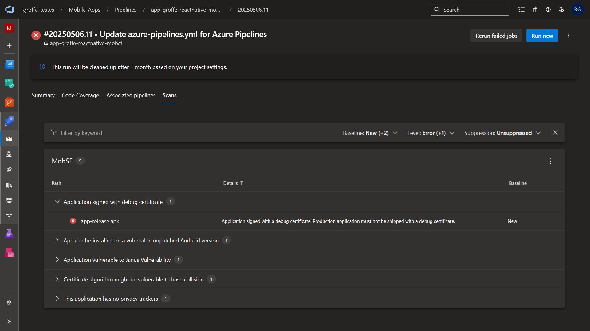
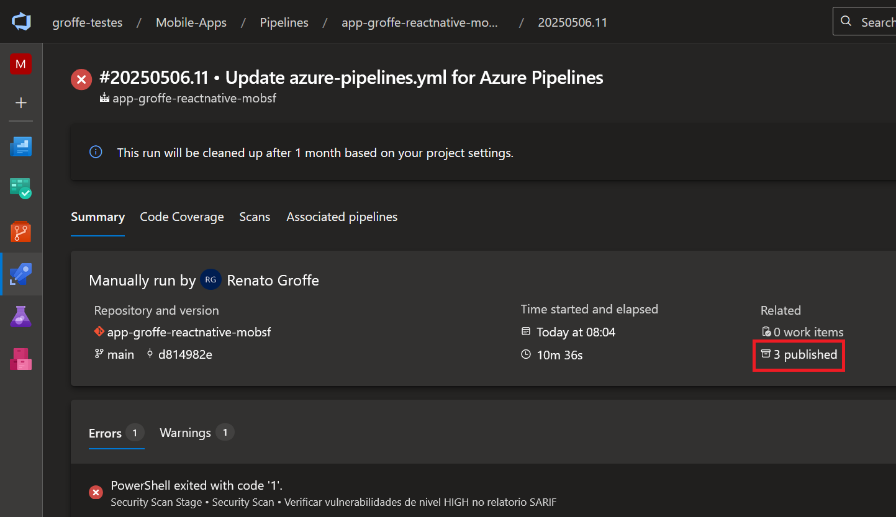
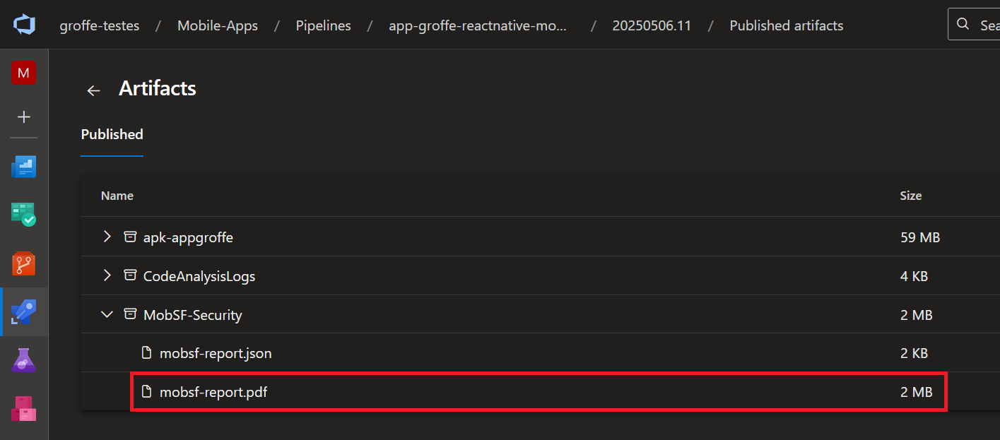
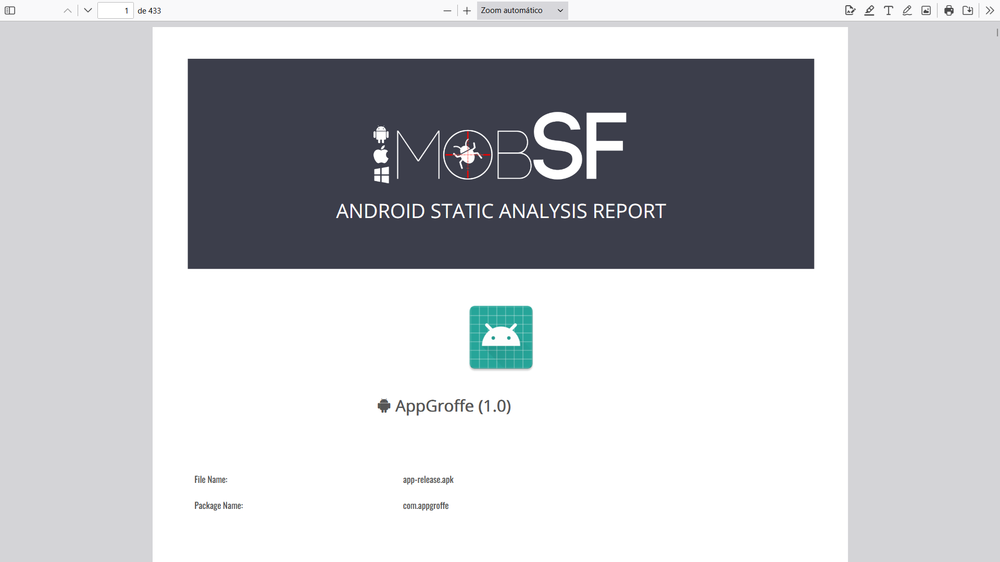
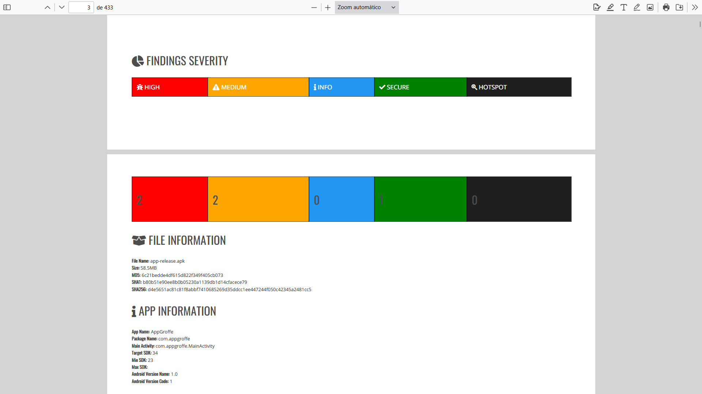

# azurepipelines-reactnative-android-build-mobsf
Exemplo de pipeline do Azure DevOps em ambiente macOS para build de um app React Native em Android. Inclui ainda o uso de um container do serviço MobSF, a fim de detectar vulnerabilidades no arquivo .apk gerado durante o build.

Links importantes:
- Mobile Security Framework (MobSF): https://github.com/MobSF/Mobile-Security-Framework-MobSF
- Imagens do MobSF no Docker Hub (as análises são executadas a partir de containers): https://hub.docker.com/r/opensecurity/mobile-security-framework-mobsf/ 

---

## Evidências dos testes

Arquivo SARIF (gerado via PowerShell):

Report PDF gerado via MobSF:

